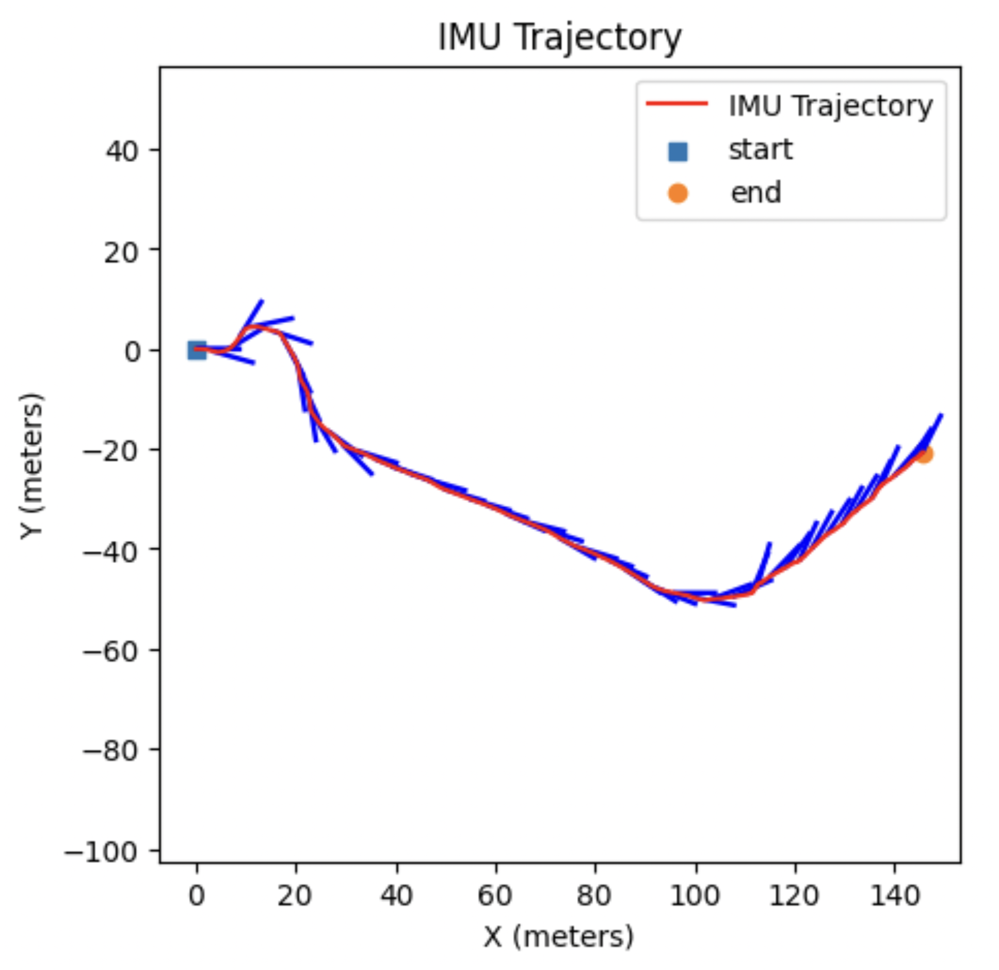
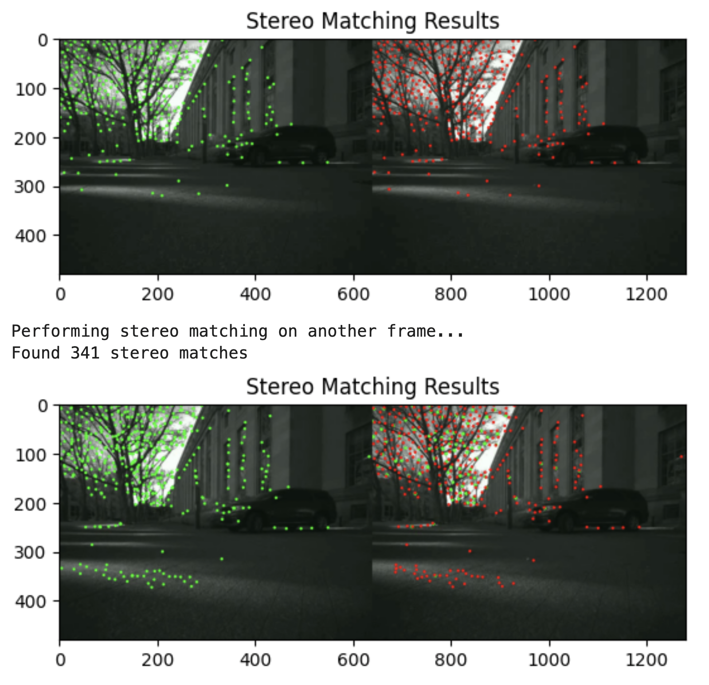
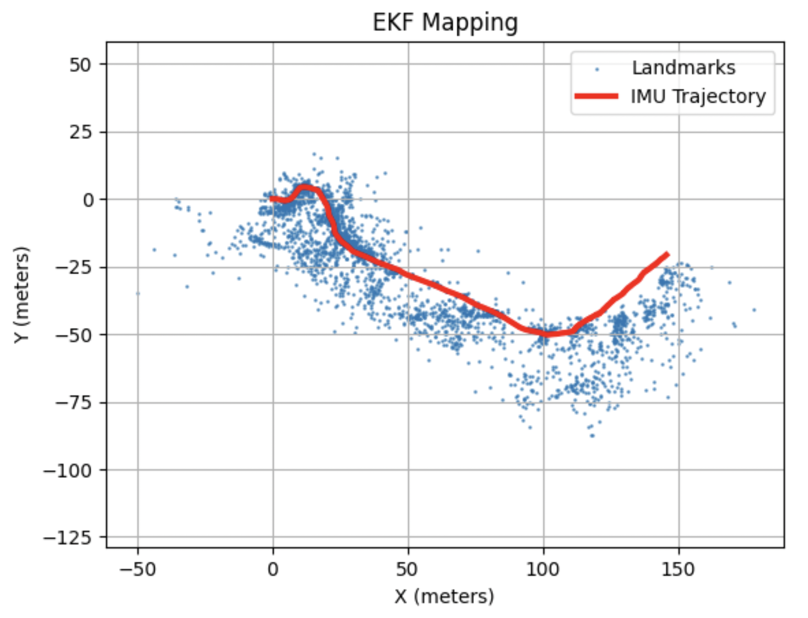
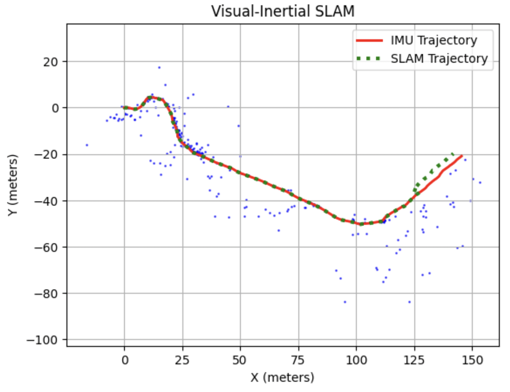

# Visual-Inertial SLAM with Extended Kalman Filter

**Yusuf Morsi**  
*Department of Electrical and Computer Engineering*  
*University of California, San Diego*  
La Jolla, CA, USA  
ymorsi@ucsd.edu

## Running

Due to academic integrity policies, the majority of my code for this project (i.e. `code/feature_detection.py`, `code/main_utils.py`, `code/pr3_utils.py`) is in my `.gitignore`, thus not publically available in this repository.

However, if you would like to see my results after the calling of the functions in my code, navigate to `data/main.ipynb` to see the cells calling the functions, with the outputs.

## Introduction

This project, which focuses on implementing Simultaneous Localization and Mapping (SLAM); is meant to solve the problem of constructing/updating a map of an unknown environment, all the while keeping track of the robot/device's location with respect to it. More specifically, our project implements Visual-Inertial SLAM, where we combine camera data from Clearpath Jackal robots navigating on MIT's campus with inertial measurement units (IMU) data. This is important as it is implemented in many technologies, including rovers on Mars, iRobot vacuum cleaners, AR headsets, and more.

We find this to be important in the context of our project because the cameras fill gaps that IMUs have, and vice versa (i.e. cameras aren't always aware of the environment when things like light, rain, etc are in the way). Knowing how to combine these two is imperative, as it allows us to get results that, on their own, the individual sensors would otherwise not be able to attain.

To reiterate, this project focuses on my implementation of a Visual-Inertial SLAM system with an Extended Kalman Filter (EKF) framework. By combining IMU kinematics for motion prediction with stereo camera data (for landmark mapping and poses), we are able to conduct IMU-only localization, then landmark mapping with EKF update, and finally, combine both elements into a complete SLAM system.

## Problem Formulation

The following is the Visual-Inertial SLAM problem in mathematical terms, quoting from [6]:

### Inputs

- IMU measurements: linear velocity **v**_t ∈ ℝ³ and angular velocity **ω**_t ∈ ℝ³ of the body with coordinates expressed in the body frame of the IMU.

- Time stamps: τ_t in UNIX time (seconds since January 1, 1970).

- Camera measurements: grayscale images with pixel length and width (600 × 480) are provided separately in datasetXX_imgs.npy.

- Visual feature measurements: pixel coordinates **z**_t ∈ ℝ^(4×M) of detected visual features from M point landmarks with precomputed correspondences between the left and right camera frames. Landmarks i that were not observable at time t have measurement 

**z**_{t,i} = [-1 -1 -1 -1]ᵀ, indicating a missing observation.

- Extrinsic calibration: transformation ^I T_C ∈ SE(3) from the left and right camera to the IMU frame. The IMU frame is oriented as x = forward, y = left, z = up.

- Intrinsic calibration: values for the camera calibration matrix for the left and right camera: 

K = [
    f_u  0   c_u
     0  f_v  c_v
     0   0    1
]

### Expected Output

- World-frame IMU pose ^W**T**_{I,t} ∈ SE(3).
- World-frame coordinates **m**_j ∈ ℝ³ of the point landmarks that generated the visual features.

### Goal

As described in [1] and [6], our main focus is to determine not only the the robot trajectory, but also landmark positions through state estimation:

Prior: **x**_t | **z**_{0:t}, **u**_{0:t-1} ~ 𝒩(**μ**_{t|t}, **Σ**_{t|t})

where **x**_t = state vector with trajectory **T**_t ∈ SE(3) and landmark positions **m** ∈ ℝ^(3M), **μ**_{t|t} is the est. mean, and **Σ**_{t|t} is the state covariance matrix.

## Technical Approach

The primary approach utilizes Extended Kalman Filter (EKF), where we have IMU-based prediction steps and camera-based update steps. We have three main stages in this project, which are, respectively: IMU localization, landmark mapping, and finally, full Visual-Inertial SLAM.

### IMU Localization via EKF Prediction

For IMU localization, we utilize the kinematic equations of motion for pose **T**_t ∈ SE(3) while using IMU measurements as inputs, as it provides us with both linear and angular velocity (**v**_t, **ω**_t).

Utilizing ECE276A lecture notes [1], we find the, the discrete-time kinematics equation used for the pose update as:

**T**_{t+1} = **T**_t exp(τ_t **ζ̂**_t)

where τ_t is the length of the time step, and **ζ̂**_t is the twist matrix.

Said matrix is created at every time step and keeps a covariance matrix for uncertainty, (which is updated per the EKF prediction equations from [1]). This gives us the ability to track the IMU pose over time while also taking measurement noise into consideration.

### Stereo Vision and Feature Processing

An additional task we deeply explored, is feature detection and tracking in stereo camera images over time. The focus of the stereo matching was to first detect features in left camera images, and match said features with corresponding points in the right camera images. The plan was then to track these features across sequential frames, implementing temporal tracking, then storing coordinates into a matrix, and using OpenCV (i.e. goodFeaturesToTrack and calcOpticalFlowPyrLK) [2] [3] for assistance.

For the Stereo-Matching task, our code process the left and right camera images in order to have feature correspondences. We read both of the video streams, convert the frames to grayscale, and detect corner features in the left image with the Shi-Tomasi detector (using goodFeaturesToTrack from OpenCV [2]). We subsequently track these features to the correct image with Lucas-Kanade optical flow (calcOpticalFlowPyrLK from OpenCV [3]) with a 21 by 21 window size and 3 pyramid levels. We ensure that points with bad tracking/outside the image boundaries are filtered before we continue processing the matched coordinates. We used the provided Github code [4] as a model to follow, especially for the stereo-matching.

For Temporal Tracking, we track features across consecutive frames from the left camera. Our pseudocode is written to read the first frame and detect initial features before initializing a feature matrix with -1 values. For frames after that, the system tracks points from the previous frame with OpenCV's calcOpticalFlowPyrLK [3]. Once again, we filter bad points before updating the feature matrix.

### Landmark Mapping via EKF Update

For landmark mapping, we use our determined IMU poses, and building on that, we estimate the landmark positions. Referring back to the lecture slides [1], we want to estimate the landmark coordinates: **m** = [**m**_1ᵀ, **m**_2ᵀ, ..., **m**_Mᵀ]ᵀ ∈ ℝ^(3M).

The observation model, taken from the lecture notes once again [1], relates landmark positions to stereo camera measurements:

**z**_{t,i} = h(**T**_t, **m**_j) + **v**_{t,i}

where h is the stereo camera projection function and **v**_{t,i} is measurement noise.

For the EKF update, we compute the Jacobian of the observation model w.r.t. landmark positions, once again as shown in the lecture slides [1] before performing the update:

**K**_{t+1} = **Σ**_t **H**_{t+1}ᵀ (**H**_{t+1} **Σ**_t **H**_{t+1}ᵀ + **R**)^(-1)  
**μ**_{t+1} = **μ**_t + **K**_{t+1} (**z**_{t+1} - **z̃**_{t+1})  
**Σ**_{t+1} = (**I** - **K**_{t+1} **H**_{t+1}) **Σ**_t  

where **z̃**_{t+1} is the predicted observation, **K**_{t+1} is the Kalman gain, and **R** is the measurement noise covariance.

### Visual-Inertial SLAM

For the final part of the project, the complete Visual-Inertial SLAM, we combine the IMU prediction step with the camera update step, but now also update the IMU pose based on observations. As we are relayed once again in the lecture slides [1], the state consists of the IMU pose **T**_t ∈ SE(3) and landmark positions **m** ∈ ℝ^(3M).

For the update step, we find the Jacobian of the observation model w.r.t. the IMU pose, once again modeling after the methodology presented in the lecture [1]. This allows us to fix the pose based on visual observations that we have of known landmarks. Despite being similar to the landmark update, the EKF update for the IMU pose differs in that it needs different handling, as the pose is an element of SE(3) instead of an Euclidean vector space, as detailed in [1] and [6].

## Results

### IMU Localization Results

Figure 1 is the result of our IMU-only localization through EKF prediction done with linear and angular velocity measurements. The trajectory (red) is the estimated path of the robot. We refer to this again in the subsequent parts (in part 3 to make sure the landmark mapping makes sense, and in part 4 to combine with the mapping).

### Feature Detection and Matching Results

Our output for this consists of two images, showing the left and right camera frames, with detected features being marked.

   

For the temporal tracking, we have a similar visualization in which the features are being tracked across consecutive frames.

### Landmark Mapping Results

Figure 2 shows the results of landmark mapping with the EKF update step with stereo vision measurements. As seen above, the blue points representing estimated landmark positions, are not only following the shape of, but also clustering near the IMU trajectory (in red). We see our landmark density decreasing as we get further away from the IMU trajectory.

We can see that although there is room for improvement (i.e. visible noise and outliers), the overall structure of the environment is preserved properly.

### Visual-Inertial SLAM Results

Figure 3 shows us the results of the final Visual-Inertial SLAM system. The green SLAM-estimated trajectory, is very much in-line with the IMU-only trajectory (red), which tells us that our code is functional. Once again, we plot our landmark map over this image (blue) to give more insight. We see that our SLAM trajectory has improvements over the IMU-only trajectory in the areas where there is more landmark density.

In the right part of the map, we can see a correction, where the trajectory deviates a bit from the IMU trajectory, telling us that using both camera and IMU data gives us insight that using just one cannot. Note that the sparsity of the landmarks in this mapping is less for efficiency reasons, as we wanted to avoid unnecessary points not needed for a proper results.

### Conclusion

By the end of this project, we found that the Visual-Inertial SLAM successfully produced improved results subsequent to combining IMU and stereo vision sensors together for the localization and mapping. We are able to see corrections, telling us that this is a useful tool that, once again, is very relevant in today's day and age.

## Acknowledgment

I would like to thank Professor Nikolay Atanasov for his guidance and support throughout this project and course.

## References

[1] N. Atanasov, "Visual-Inertial SLAM," ECE276A: Sensing & Estimation in Robotics, University of California San Diego, Lecture 12, 2025. [Online]. Available: https://natanaso.github.io/ece276a/ref/ECE276A_12_VI_SLAM.pdf

[2] OpenCV Documentation, "Shi-Tomasi Corner Detector," 2023. [Online]. Available: https://docs.opencv.org/4.x/d4/d8c/tutorial_py_shi_tomasi.html

[3] OpenCV Documentation, "Optical Flow," 2023. [Online]. Available: https://docs.opencv.org/4.x/d4/dee/tutorial_optical_flow.html

[4] K. Sun et al., "MSCKF_VIO: Multi-State Constraint Kalman Filter for Visual-Inertial Odometry," 2023. [Online]. Available: https://github.com/KumarRobotics/msckf_vio/blob/master/src/image_processor.cpp

[5] T. D. Barfoot, *State Estimation for Robotics*. Cambridge University Press, 2017.

[6] N. Atanasov, "Project 3," ECE276A: Sensing & Estimation in Robotics, University of California San Diego, Project 3, 2025. [Online]. Available: https://natanaso.github.io/ece276a/ref/ECE276A_PR3.zip